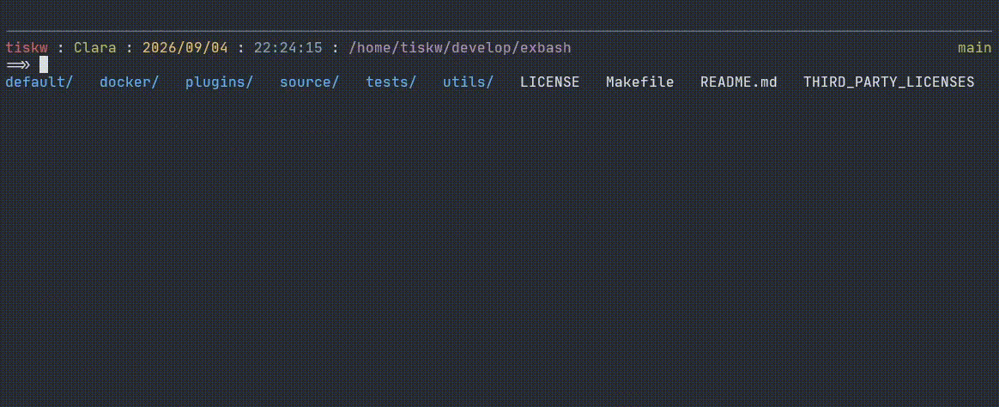
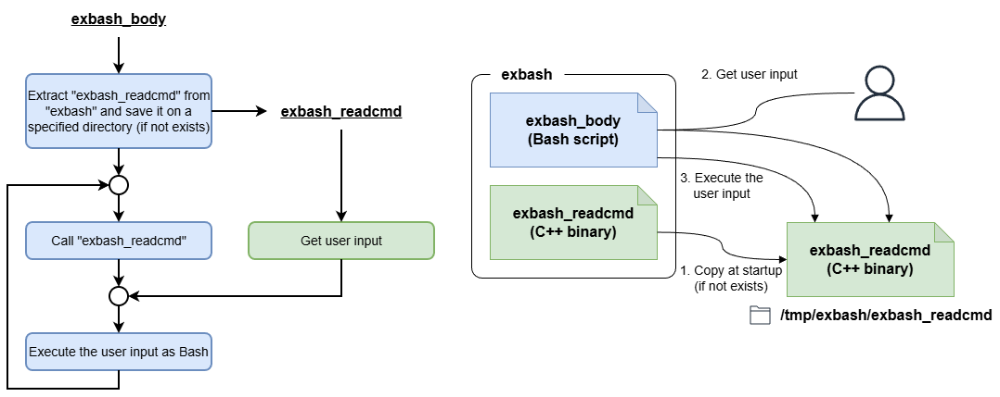

ExBash - Extended editing features on Bash
====================================================================================================

<p align="center">
  
</p>

<p align="center">
   &nbsp;
   &nbsp;
   &nbsp;
  
</p>

ExBash is a [Bash](https://www.gnu.org/software/bash/)-compatible interactive shell that enhances
command-line editing with real-time syntax highlighting, context-aware completion, inline file
preview, and input prediction from command history.

<p align="center">
  
</p>

### Motivation

ExBash is motivated by a simple question:

<p align="center">
  <i>Why is command input still limited to plain text typing?</i>
</p>

Modern shells like Bash, Zsh, and fish provide powerful completion systems. However, gaps still
remain in the command input experience. For example, consider typing a command like:

```
cat ~/documents/my_project/memo.txt | grep keyword
```

Even with completion, selecting a file path often requires multiple keystrokes or partial typing.
In practice, developers often resort to interactive tools such as fuzzy finders to locate files,
especially when file paths are long or only vaguely remembered. These tools are effective, but
they exist outside the act of command composition itself. Users must stop typing, invoke a tool,
make a selection, copy the result to the clipboard, and then return to the command line. This
friction is minor in isolation, but accumulates during everyday command-line work. Similar
frictions occur when selecting process IDs, browsing command history, and in other common tasks.

ExBash aims to remove these frictions by introducing a structured, interactive TUI for command
input &mdash; allowing users to make selections in a TUI and insert them directly into the command
line without breaking the rhythm of typing.


Installation
----------------------------------------------------------------------------------------------------

### Prerequisites

* Mandatory requirements
  - Linux on x86-64 (including WSL2)
  - Bash >= 5.2

Other architectures may work when built from source, but are not currently tested.

### Installation

```shell
# Create the installation directory.
mkdir -p ~/.local/share

# Download the latest ExBash release from the GitHub releases page and unpack it under ~/.local/share.
curl -fsSL https://github.com/tiskw/exbash/releases/latest/download/exbash_$(uname -m).tar.gz | tar xz -C ~/.local/share

# Add ExBash to PATH for the current shell session.
# Add this line to your .bashrc to make the change persistent.
export PATH="${HOME}/.local/share/exbash/bin:${PATH}"
```

### Uninstallation

To uninstall ExBash, simply delete the `exbash` directory and the symbolic link you created in the installation step.
If you want to remove your config files and plugins, delete the `~/.config/exbash` directory as well.

```shell
# To uninstall ExBash, just remove the 'exbash' file and the symbolic link.
rm -rf ~/.local/share/exbash

# If you want to remove your config files and plugins, remove ~/.config/exbash.
rm -rf ~/.config/exbash
```


Usage
----------------------------------------------------------------------------------------------------

ExBash behaves like an interactive Bash session for ordinary command execution. To try the built-in
completion, launch `exbash` in the root of a cloned ExBash repository and type `git diff README.md`.
You can enjoy various types of command completions provided by ExBash while typing the words.
A list of completion candidates is shown under your editing line, and if there is only one candidate,
you can complete it by typing the `TAB` key. For example, `git d<TAB>` results in `git diff` and
also, `git diff R<TAB>` results in `git diff README.md`.

ExBash can launch specific programs and modify the buffer you are currently editing. For example,
type `ls ` and then press `<Ctrl-F>`. A file list will appear on your terminal window, allowing you
to select files. Select a file and press Enter. Then the file list will disappear, and you will
return to the original editing screen with the selected file name added to the current editing
buffer. Similarly, you can select a command from the command history list and insert it into
the current editing buffer using Ctrl-U, and a process ID from the process list using Ctrl-P. This
functionality is achieved through ExBash's plugin system. See the plugins section below for details.


Customize ExBash
----------------------------------------------------------------------------------------------------

### Basic customization

There are two configuration files for customizing ExBash's behavior, `~/.config/exbash/config.toml`
and `~/.config/exbash/bashrc`. The reason there are two configuration files is as follows:
Shell functions are generally divided into two parts: receiving user input and executing it.
ExBash uses its own implementation, the `exbash_readcmd` command, to receive user input, but relies
on Bash to execute it. The configuration file for the user input part (the configuration file for
`exbash_readcmd`) is `config.toml`, and the configuration file for Bash, which executes user input,
is `bashrc`. The `config.toml` is a proprietary TOML file, while `bashrc` follows Bash syntax.

Immediately after installing ExBash, these configuration files do not exist. Instead, files located
in the `default` directory within the installation directory are used. If you want to change
the default configuration, copy these default files into `~/.config/exbash` and edit them there.

### Extending completion functionality

The config file `~/.config/exbash/config.toml` contains the `completions` entry that controls
the completion behavior of ExBash. By modifying this item, users can customize the completion
behavior in ExBash.

The format of the `completions` items is `[patterns, completion_type, optional_string]`.
Each variable is explained below.

* The variable `patterns` is a list of regular expressions and special tokens. If the tokenized user's input
  matches this pattern, the completion is applied. The following are the special tokens that are
  allowed to be used in the pattern list:
    - `>>`: Skip all tokens.
    - `FILE`: Matches for an existing file.
  For example, a pattern `["git", "branch", ">>", ".*"]` matches user input `git branch ma` because
  the user input is tokenized into `["git", "branch", "ma"]`.
* The `completion_type` is a kind of completion, and `optional_string` is an optional string
  required for some completion types. The following is a list of available completion types:
    - `command`: Complete commands registered in PATH. Optional string is not used (any optional
                 string will not affect the result).
    - `grep`: Complete with regular expression. The optional string is a pair of a target file and
              a regular expression that matches completion candidates, and these two are separated
              by a TAB character. For example, if the optional string is `~/.ssh/config\tHost (\\w+)`,
              the completion candidates are generated by searching strings that match `Host (\w+)`
              in the `~/.ssh/config` file, and the first group of the matched string is used as
              a completion candidate.
    - `option`: Complete options of the current command (i.e. the first token of the user input).
                Optional string is not used (any optional string will not affect the result).
    - `path`: Complete file paths. Optional string is not used (any optional string will not affect
              the result).
    - `preview`: Show file preview. Optional string is not used (any optional string will not affect
                 the result).
    - `shell`: Run the optional string as a shell command and use its output as completion
               candidates.
    - `subcmd`: Complete sub commands. The optional string is a command to retrieve a help message
                that contains subcommands.
* If `bash-completion` is installed, the `bashcomp` completion type is also available. This completion
  uses the `bash-completion` command in the background, so it provides completions in the same way as
  Bash does. Optional string is not used (any optional string will not affect the result). However,
  the author does not recommend using `bashcomp`, because it is not very fast even though
  the completion contents are good in all circumstances.

The following are examples of fully working completion configurations, which are already included
in `config.toml`.

```toml
completions = [

    # Complete Docker container names when user input is "docker exec ...".
    [["docker", "exec", ">>"], "shell",  "docker container ls -a --format '{{.Names}}'"],

    # Complete Docker image names when user input is "docker run ...".
    [["docker", "run",  ">>"], "shell",  "docker image ls --format '{{.Repository}}:{{.Tag}}'"],

    # Completion of file preview (as an example of the FILE token).
    [[">>", "FILE", ""], "preview", ""],
]
```

Note that the `bashcomp` completion, that uses the `bash-completion` command in the background,
is convenient in all circumstances, but it is not very fast. The author recommends using other
completion types than `bashcomp` whenever possible, especially for commands that are frequently
used.

### Plugins

ExBash supports a plugin system. Plugins can modify the current command buffer while you are typing.
That is, plugins can be invoked while the user is typing a command, and can modify the buffer
the user is editing accordingly. For example, the `omnipicker` plugin, introduced below, allows you
to select a file path in a text user interface and insert the selected items into the current
buffer.

The ExBash repository provides several plugins. The startup commands for these plugins are already
written in the configuration file and are ready to use. Below is a brief description of each plugin.

* **omnipicker**: This plugin allows you to select file paths, command histories, process IDs, and
                  past command snippets in the TUI, and insert the selected items into the buffer
                  you are editing in ExBash. The `-m` option specifies the mode. By default,
                  `Ctrl+F` launches the file picker, `Ctrl+P` launches the process number picker,
                  and `Ctrl+U` launches the command history picker. These trigger keys can be
                  changed in the configuration file (`config.toml`).

| Default trigger key | Plugin command       | Description                               |
|---------------------|----------------------|-------------------------------------------|
| Ctrl-F              | `omnipicker -m file` | Select a file path                        |
| Ctrl-P              | `omnipicker -m pid`  | Select a process number                   |
| Ctrl-U              | `omnipicker -m hist` | Select a command from the command history |

### Write a new plugin

The default plugins, `omnipicker`, is written as a standalone C++ program, but there is no
requirement to write a plugin in C++. In other words, by creating software with an interface
equivalent to `omnipicker`, you can create a plugin that modifies the ExBash current buffer like
`omnipicker` in any programming language you like. The required behavior of a plugin is very simple:
it just outputs a file to a specific path upon exit. The output path must match the `output_plugin`
in `config.toml`, which defaults to `/dev/shm/exbash/plugin.out` (the directory `/dev/shm` is
a tmpfs mount point used as the actual location of POSIX shared memory, such as shm\_open, and
in many environments, it is automatically provided at boot time). The output file must consist of
two lines, the first line corresponding to the string to the left of the cursor, and the second line
corresponding to the string to the right of the cursor. ExBash completely overwrites the buffer
being edited with the plugin's output content. Therefore, if you want to keep the string to the left
of the cursor unchanged, for example, the plugin must somehow know the current buffer contents.
The `omnipicker` plugin achieves this with command line arguments, that is, the `-l` option receives
the string to the left of the cursor, and the `-r` option receives the string to the right of
the cursor. For details, see the section on key binding settings in `config.toml`.


Frequently Asked Questions
----------------------------------------------------------------------------------------------------

### How does ExBash work?

ExBash consists of two executable files, a binary file `exbash_readcmd` that provides command
editing functionality in place of [GNU Readline](https://tiswww.case.edu/php/chet/readline/rltop.html),
and a Bash script (readable part of `exbash`) that makes it behave like Bash. Since all commands are
executed in the Bash script, existing assets created for Bash are expected to work almost as is in
ExBash (e.g., `.venv/bin/activate`, which activates a Python venv environment).

The binary file `exbash_readcmd` is embedded into the bash script `exbash`, and will be extracted
under `/tmp/exbash` when ExBash is started. Therefore, users only need to install a single file,
`exbash`, reducing the effort required for installation. The first half of the `exbash` file is
a regular bash script (`exbash_body`), but the remaining part is a binary (`exbash_readcmd`) that is
not readable. The size of the `exbash` file is large for a bash script because the second half is
a binary.

### Security Considerations

* ExBash does not restrict command execution; all commands are run as Bash commands under
  the current user's permission. Please pay close attention when running ExBash with elevated
  privileges (e.g., run as the root user or via sudo).
* User input is processed for completion and preview features. External commands used for completion
  and preview are completely controllable by the config file, however, malicious input may cause
  unexpected behavior.
* Command history and file preview may expose sensitive information. Please review and restrict
  preview targets and access to history files as needed.
* Dependencies are regularly updated, but users should check for known vulnerabilities in
  the included libraries (e.g., toml++).


Architecture
----------------------------------------------------------------------------------------------------

As explained in the FAQ, ExBash is not a single binary file, but actually consists of two files,
`exbash_body` and `exbash_readcmd`. This design preserves Bash command execution while replacing
the line-editing layer, at the cost of a slightly more complex startup architecture. For those who want
to know more, the author prepared a simple architectural diagram that shows how ExBash works.

<p align="center">
  
</p>


Gratitude
----------------------------------------------------------------------------------------------------

This software uses the following libraries. I appreciate their devoted contributions to these libraries.
* [cxxopts](https://github.com/jarro2783/cxxopts): Header-only lightweight C++ command line option parser.
* [toml++](https://github.com/marzer/tomlplusplus): Header-only TOML file parser.
* [utf8proc](https://github.com/JuliaStrings/utf8proc): UTF-8 processing library. The UTF-8
  related code in this repository is partially derived from utf8proc.
* [Musl-libc](https://musl.libc.org/): The ExBash release binary is statically linked to Musl
  library using [Alpine Linux](https://www.alpinelinux.org/) on [Docker](https://www.docker.com/).
* And, of course, [C++](https://isocpp.org/) and [Bash](https://www.gnu.org/software/bash/)
  maintainers, because this software is heavily dependent on C++ and Bash.


License
----------------------------------------------------------------------------------------------------

* The source code of ExBash is released under the [MIT license](LICENSE).
* See [Third-party licenses](THIRD_PARTY_LICENSES) for the licenses of third-party libraries
  used in ExBash.


For developers
----------------------------------------------------------------------------------------------------

This section contains information for developers of ExBash, or users interested in implementation details.

### How to build ExBash from scratch

```console
# Clone this repository and move to its root directory.
git clone https://github.com/tiskw/exbash.git
cd exbash

# Build a Docker image.
cd docker
sh build.sh

# Build binary files on the Docker image.
cd ..
make release
```

If the `release` directory is generated, the build is successful.

